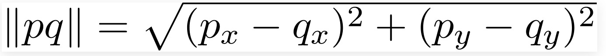

# Closest Pair of Points

**Input:** an array of n points

**Output:** the smallest distance between two points in the given array.

Formular for calculating distance between 2 points *p* & *q:*



# Naive algorithm

Compute the distance between each pair and return the smallest.

Pseudo code:

```python
def calculate_distance(p1, p2):
	return math.sqrt(
		(p1.x - p2.x)*(p1.x - p2.x) + (p1.y - p2.y)*(p1.y - p2.y)
	)

def find_closest_point(input):
	point1, poin2, distance = None

	for i in range(input):
		point1 = input[i]
		for j in range(i, len(input)):
			point2 = input[j]
			distance_between = calculate_distance(point1, point2)
			
			# first iteration
			if not distance:
				distance = distance_between
			else:
				distance = distance_between if distance_between < distance else distance
			continue

	return distance
```

# Divide and conquer algorithm

## Ideas

- 2 dimensions, divide and conquer
- Find 2 points with closest distance in the 1st half
- Find 2 points with closest distance in the 2nd half
- Find closest pair across separating line (in the middle)

## Flow

- Original list is `P` . Sort this list based on `x` coordinates
- Find the middle point → Divide the list to 2 half `L` and `R`
- Recursively find the smallest distance in each half (`d_left` and `d_right`) → Minimum is `d min(d_left, d_right)`
- Consider the case where 1 point is in 1st half and the other is in 2nd half
    - Consider the vertical line passing through `P[n/2]` (middle line) → Find all points having distance to middle line < `d`
    - If there are cross-list points → those 2 points *have to be* in this **"middle zone"**


# Resources

[](https://sites.cs.ucsb.edu/~suri/cs235/ClosestPair.pdf)

[Closest Pair of Points using Divide and Conquer algorithm - GeeksforGeeks](https://www.geeksforgeeks.org/closest-pair-of-points-using-divide-and-conquer-algorithm/)

[Closest pair of points](https://www.youtube.com/watch?v=6UBDkbVhJck)