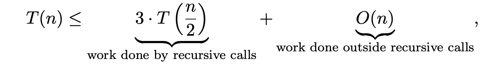
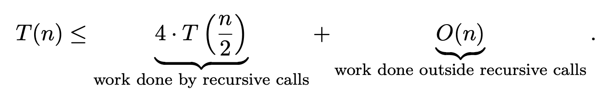

# The Master Method

A general mathematical method to analyse the running time of divide and conquer algorithms.

# Integer Multiplication

**Input**: Two n-digit nonnegative integers, x and y.

**Output**: The product x · y.

## Naive algorithm

T(n): max number of operations the algorithm

Recurrence: express T(n) in terms of running time of **recursive calls**

**Base case**

- n is too small to trigger any recursive calls
- T(1) = 1

**For all n > 1:**

## The Karatsuba Algorithm

The trick is to recursively compute the products of a and c, b and d, and a+b and c+d, and extract the middle coefficient ad+bc via (a+b)(c+d) - ac - bd.

**Base case**

T(1) = 1

**For a n > 1:**

