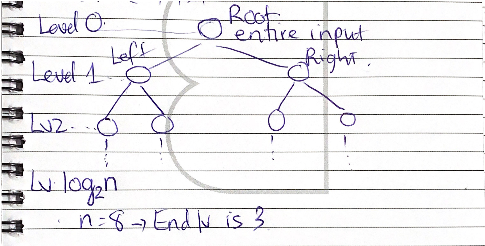
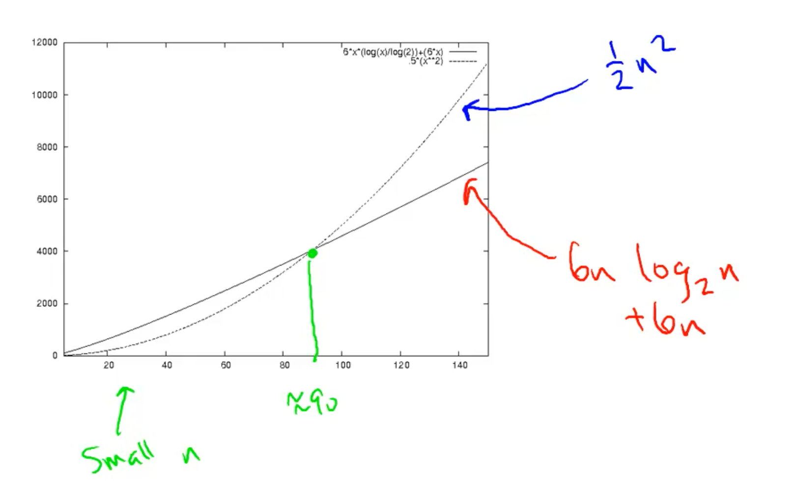

# Merge Sort

## Running time (the amount of operations) per Merge problem
Running time of Merge (alone) on an array of n numbers is <= 4n + 2 (relatively). In code, this is amount of operations inside a `merge_sort` function.  
To ignore constant factors, we could assume that the amount of operations per problem is 6n.

## Total running time of Merge Sort 
For `n` input size, Merge Sort products a sorted output array and uses *at most* **6nlog2n + 6n** *operations*.

## Algorithm analysis
### Recursion tree
Count the work done by an algorithm, used in algorithm analysis.
*Base case*: single-element array.

* As Merge Sort calls itself *twice*, the number of sub-problems *doubles in each level*.
-> at a certain level, `j` for instance, the number of problems (same level) is `2^j`.
* The **input size** (n in this case) halves *in each level* -> the amount of sub-problems (lower level) in `j` level is `n/2^j`

### Total amount of operations in a Merge Sort
* Amount of levels: `log2n + 1`
* Amount of operations *per level*:
	* Amount of problems in level `j`: `2^j`
	* For each problem in level `j` -> Amount of sub-problems `n/2^j`
		* Amount of operations per sub-problem: 6
		* -> Amount of operations in all sub-problems: `6x(n/2^j)`
	* -> Total amount of operations in level `j`: `2^j x (6 x (n/2^j))` = `6n`
* Total amount of operations in *all levels*: `6n x (log2n + 1)`

## Guilding principles in algorithm analysis
1. Worst-case analysis
2. Pay no (or less) attention to constant factors, i.e lower-order terms (4n + 2 ~ 6n)
	* Constants might depend on compiler, programming language
3. Asymptotic analysis: focus on running time *for large input size n*

## What is a "Fast" Algorithm?
> Worst-case running time grows slowly with input size

* Worst-case: large input size + ignoring constant factors for predictablity (you simply can't control everything)
* Time grows slowly:
	* Holy grail: **linear** running time (or close to it)

## Resources
[Logarithm Calculator](https://www.rapidtables.com/calc/math/Log_Calculator.html)  
[Merge Sort code sample](https://www.geeksforgeeks.org/merge-sort/)  
[Merge Sort in Python](https://stackabuse.com/merge-sort-in-python/)